# Agent 기반 RAG 학습 지도

이 문서는 RAG 기반 Agent의 데이터 검색과 도구 실행 흐름을 학습하기 위한 지도이다. `2_agent_multi_tool.ipynb`의 FAQ 검색·저장 예제를 중심으로 기초를 익힌 뒤, `12_React_agent`의 ReAct 실행, 병렬 호출, 미들웨어 안전장치와 승인 인터럽트로 확장한다.

기존 `rag-flow.md`가 일반적인 RAG 체인의 흐름을 설명한다면, 이 문서는 다음 기능을 함께 연결한다.

- PostgreSQL과 PGVectorStore 초기화
- Embedding과 벡터 검색
- 일반 검색과 분야 필터 검색
- LangChain Tool과 Pydantic 입력 스키마
- Agent의 Tool 선택
- FAQ 검색 결과 CSV 저장
- CSV 저장 결과 검증
- 실행 결과와 디버깅 위치 확인
- ReAct Agent의 반복적인 Tool 호출과 메시지 흐름
- 독립 Tool의 병렬 호출과 순서가 필요한 작업의 구분
- Tool 오류·모델 호출 제한 미들웨어
- 부작용이 있는 Tool의 승인 대기와 실행 재개

## 구현 상태 안내

이 문서는 현재 노트북에 있는 코드와 앞으로 구현·학습할 설계를 함께 담고 있다. 아래 표기를 기준으로 현재 기능과 목표 설계를 구분한다.

- **구현 확인**: 저장소의 노트북에서 해당 기능을 수행하는 코드를 확인했다. 학습용 노트북 코드이며, 운영용 애플리케이션으로 제공된다는 뜻은 아니다.
- **부분 구현**: 관련 개념이나 단위 예제는 있지만, 이 문서에 그려진 전체 흐름 또는 평가 기능은 연결되어 있지 않다.
- **설계/확장**: 현재 구현으로 확인되지 않은 목표 구조나 실습 아이디어다.

| 기능 | 상태 | 확인 위치 또는 범위 |
|---|---|---|
| PGVectorStore FAQ 색인·검색, 분야 필터, MMR, RAG 응답 | **구현 확인** | 10_agent/1_pgvector_langchain.ipynb, 10_agent/2_lagnchain_detail.ipynb |
| Agent 도구 호출, Pydantic 입력 스키마, CSV 저장·검증 | **구현 확인** | 11_langchain_agent.ipynb/2_agent_multi_toll.ipynb |
| PostgreSQL 대화 이력 저장·조회 | **구현 확인** | 10_agent/2_lagnchain_detail.ipynb |
| MCP 도구 연결, Tavily 검색 도구, Markdown 파일 저장 예제 | **구현 확인** | MCP 노트북, 11_langchain_agent.ipynb/3_agent_basic.ipynb |
| ReAct Agent 기본 흐름과 병렬 Tool 호출 | **구현 확인** | 12_React_agent/1_react기초.ipynb, 2_병렬도구호출.ipynb |
| Tool 오류 처리와 모델 호출 횟수 제한 | **구현 확인** | 12_React_agent/3_미들웨어안전장치.ipynb |
| 메일 발송 승인 인터럽트 및 실행 재개 | **부분 구현** | 대화 trace에 `__interrupt__` 확인. 저장소의 정책 설정과 재개 호출부 연결 여부는 별도 확인 필요. |
| FAQ 결과 부족 여부에 따른 조건부 Tavily fallback | **설계/확장** | 17절 search_with_fallback() 예제. 현재 노트북에는 같은 조건부 흐름이 없다. |
| retrieve_faq(), ask_rag() 중심의 통합 함수 구조 | **설계/확장** | 현재는 노트북별 체인과 함수 예제로 나뉘어 있다. |
| Hit@k·MRR 및 답변·도구 선택 평가 | **부분 구현** | 평가 노트북에 지표 설명과 후보 재정렬 실험은 있지만, 통합 평가 파이프라인은 확인되지 않았다. |
| 비교 분석 후 Markdown 보고서 생성 | **설계/확장** | Markdown 저장 예제는 있으나 비교 분석과 보고서 생성의 전체 흐름은 구현되어 있지 않다. |

상태는 저장소의 학습용 노트북을 기준으로 판정했다. 노트북 셀은 실행 환경과 데이터베이스 상태에 따라 별도 준비가 필요할 수 있다.

## 1. 전체 시스템 개요

먼저 세부 파라미터보다 구성요소 간 연결을 확인한다.

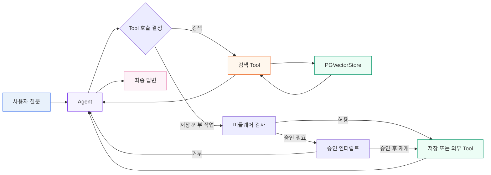

### 큰 흐름

```text
사용자 질문
→ ask(question)
→ HumanMessage
→ Agent
→ Agent가 Tool 호출을 선택
→ 미들웨어 정책 확인 (필요 시 승인 인터럽트 후 재개)
→ Tool 실행, 병렬 호출 또는 승인 거부 처리
→ Tool 결과를 Agent에 반영
→ 최종 답변
```

### 프로젝트 목표에서 구조를 선택하는 순서

새 프로젝트를 시작할 때는 구현 기술보다 목표와 작업 구조를 먼저 정한다. 아래 순서로 질문하면 필요한 구조를 좁힐 수 있다.

| 단계 | 확인할 질문 | RAG 예시 |
|---|---|---|
| 1. 목표와 성공 기준 | 누구의 어떤 문제를 해결하며, 무엇으로 성공을 확인하는가? | FAQ 질문에 근거 문서를 붙여 답변한다. |
| 2. 입력과 출력 | 시스템이 받는 값과 돌려줄 값은 무엇인가? | 질문·분야 입력 → 답변·출처 출력 |
| 3. 작업 분해 | 결과를 만들려면 어떤 작업이 필요한가? | FAQ 검색, 문서 포맷팅, 답변 생성 |
| 4. 순서와 의존성 | 어떤 작업이 앞 작업의 결과를 기다리는가? | 답변 생성은 검색 Context를 받은 뒤 실행 |
| 5. 구조 선택 | 순서가 고정인가, 요청마다 실행 경로가 달라지는가? | 고정 흐름은 함수·체인, 동적 Tool 선택은 Agent |
| 6. 작은 단위 구현 | 각 작업을 따로 실행하고 확인할 수 있는가? | 먼저 `retrieve_faq()`를 확인 |
| 7. 연결과 검증 | 전체 흐름과 실패 상황을 확인했는가? | 검색 결과 없음, 잘못된 분야, DB 오류 확인 |
| 8. 확장 | 복잡한 기능이 실제로 필요한가? | 기본 RAG 확인 후 대화 이력·웹 검색·Agent 추가 |

```text
작업 순서가 항상 같음       → 일반 함수 또는 고정 체인
요청에 따라 작업이 달라짐   → Router 또는 Agent 검토
작업들이 서로 독립적임     → 기본 흐름 확인 후 병렬화 검토
뒤 작업이 앞 결과를 사용함 → 순차 실행
```

처음에는 가장 단순한 흐름을 만들고, 각 단계가 확인된 뒤 Agent나 병렬 처리를 추가한다.
## 2. 문서 목차와 학습 목표

| 목차 | 학습 목표 | 핵심 코드 |
|---|---|---|
| 1. 전체 시스템 개요 | 구성요소 연결 파악 | `ask`, `agent` |
| 2. 환경과 초기화 | 실행 전 객체 생성 이해 | `load_dotenv`, `PGEngine` |
| 3. Vector Store | 문서, 벡터, metadata 이해 | `PGVectorStore` |
| 4. Retriever | 검색 방식과 파라미터 실험 | `k`, `fetch_k`, `lambda_mult` |
| 5. Tool과 Schema | 함수 입력 계약 이해 | `@tool`, `BaseModel`, `Field` |
| 6. Agent 실행 | LLM의 Tool 선택 이해 | `create_agent` |
| 7. CSV 저장과 검증 | 외부 파일 처리 이해 | `DictWriter`, `DictReader` |
| 8. 실행 결과 | 메시지와 중간 결과 확인 | `result["messages"]` |
| 9. 디버깅 | 문제 위치를 단계별로 좁히기 | 중간 결과 출력 |
| 10. 확장 | 비교 분석과 Markdown 보고서 | 다중 검색, 파일 생성 |
| 11. ReAct·병렬 호출·안전장치 | 반복 실행, 병렬성, 승인 흐름 이해 | `tool_calls`, `middleware`, `__interrupt__` |

각 목차는 다음 질문에 답하도록 학습한다.

```text
이 개념은 무엇인가?
왜 필요한가?
어떤 입력을 받는가?
어떤 결과를 반환하는가?
어떤 파라미터가 동작을 바꾸는가?
문제가 생기면 어느 지점부터 확인하는가?
```

## 3. 환경과 초기화

실행 전 객체가 어떤 순서로 만들어지는지 확인한다.

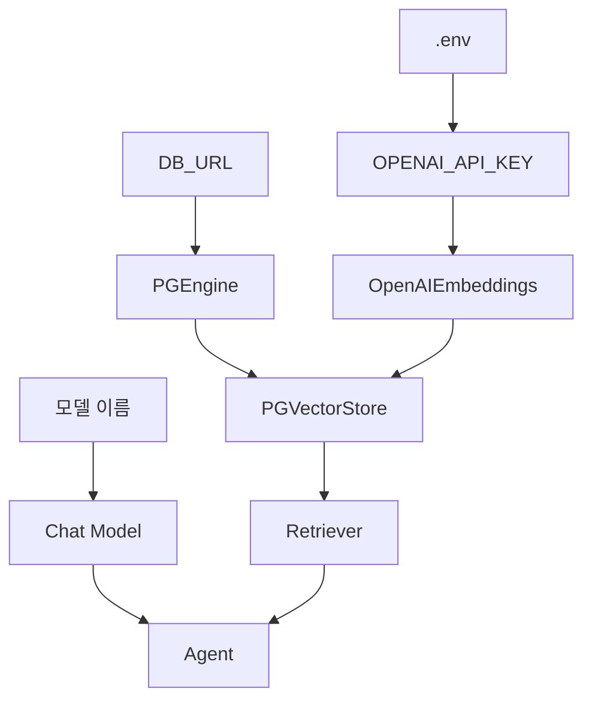

### 확인할 개념

- `.env`: API 키와 같은 환경 설정을 읽는 파일
- `PGEngine`: PostgreSQL 연결을 관리하는 객체
- `OpenAIEmbeddings`: 텍스트를 벡터로 변환하는 모델
- `PGVectorStore`: 문서 벡터와 metadata를 검색하는 저장소
- `Chat Model`: Tool을 선택하고 답변을 생성하는 모델
- `Agent`: 모델과 Tool을 연결한 실행 주체

### 초기화 문제 확인 순서

```text
API Key 확인
→ DB_URL 확인
→ PostgreSQL 실행 상태 확인
→ PGEngine 연결 확인
→ PGVectorStore 테이블과 컬럼 확인
→ Embedding 모델 확인
→ Agent 생성 확인
```

## 4. Vector Store와 Document

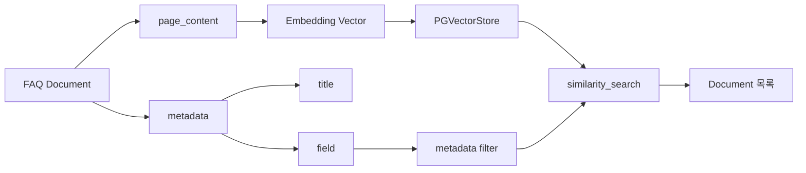

### 핵심 개념

| 구성요소 | 역할 |
|---|---|
| `page_content` | 실제 의미 검색 대상인 FAQ 본문 |
| `metadata` | 검색 필터와 결과 표시를 위한 부가 정보 |
| `field` | 의료 분야, 공공기관 등의 분야 필터 |
| `title` | 답변에 근거 제목을 표시하기 위한 값 |
| `embedding` | 문장을 숫자 벡터로 변환한 결과 |
| `doc_id` | 문서를 구분하는 고유 ID |

### 학습 질문

- 왜 일반 문자열 검색 대신 벡터 검색을 사용하는가?
- `field`와 `title`을 metadata로 분리하는 이유는 무엇인가?
- 질문과 문서는 같은 Embedding 모델을 사용해야 하는가?
- 검색 결과의 `page_content`와 `metadata`는 각각 어디에 사용되는가?

## 5. Retriever와 검색 파라미터

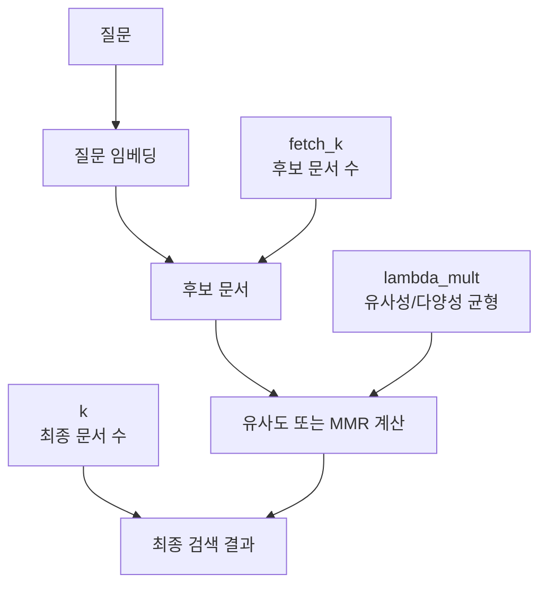

### 주요 파라미터

| 파라미터 | 의미 | 실험 질문 |
|---|---|---|
| `search_type` | `similarity` 또는 `mmr` 검색 방식 | 중복 문서가 줄어드는가? |
| `k` | 최종 반환할 문서 수 | 문서 수가 늘면 답변이 좋아지는가? |
| `fetch_k` | MMR 후보 문서 수 | 후보를 많이 보면 다양성이 좋아지는가? |
| `lambda_mult` | 유사성과 다양성의 균형 | 관련성 중심과 다양성 중심 결과가 어떻게 다른가? |

### 파라미터 실험 순서

```python
for search_type in ["similarity", "mmr"]:
    test_retriever = store.as_retriever(
        search_type=search_type,
        search_kwargs={"k": 4},
    )
    docs = test_retriever.invoke("의료 분야 CCTV 관리")
    print(search_type, len(docs))
```

```text
1. similarity와 mmr 비교
2. k=1, 4, 8 비교
3. fetch_k 변화 확인
4. lambda_mult=0.0, 0.5, 1.0 비교
5. 검색 문서의 제목과 분야 확인
```

## 6. Tool과 Pydantic Schema

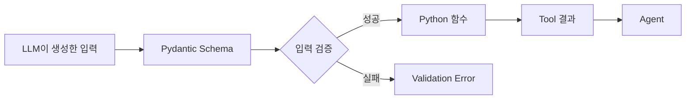

### Tool의 구조

```text
Tool 이름
→ 입력 스키마
→ 함수 실행
→ 문자열 또는 구조화된 결과
→ Agent로 반환
```

### 주요 개념

- `@tool`: Python 함수를 Agent가 호출할 수 있는 Tool로 변환한다.
- `BaseModel`: Tool 입력의 전체 구조를 정의한다.
- `Field`: 각 입력의 의미를 LLM에게 설명한다.
- `Literal`: 허용할 수 있는 값을 제한한다.
- `args_schema`: 함수와 Pydantic 입력 모델을 연결한다.

`Field(description=...)`는 단순한 주석이 아니다. Agent가 어떤 값을 넣어야 하는지 판단하는 Tool 사용 설명서이다.

### Tool 설명 양식

각 Tool은 다음 형식으로 정리한다.

```text
Tool 이름: search_by_field
입력: query, field
처리: field metadata 필터 + similarity search
출력: format_docs 결과 문자열
실패 조건: 허용되지 않은 field 또는 검색 문서 없음
```

## 7. Agent 실행

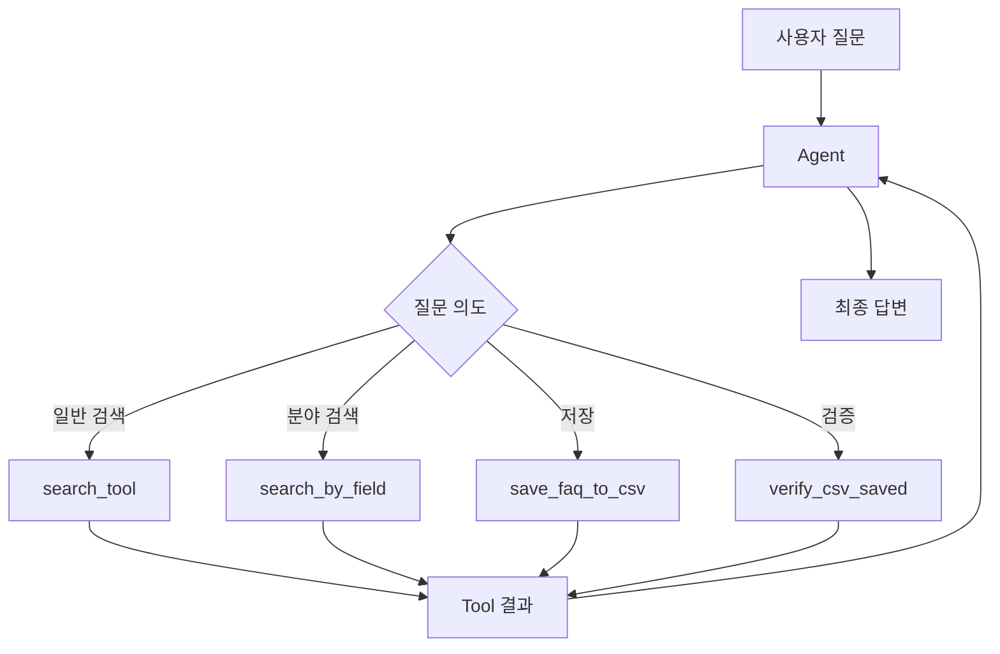

### Agent를 구성하는 세 요소

```python
agent = create_agent(
    model=model,
    tools=[
        search_tool,
        search_by_field,
        save_faq_to_csv,
        verify_csv_saved,
    ],
    system_prompt=system_prompt,
)
```

| 요소 | 역할 |
|---|---|
| `model` | 질문을 해석하고 Tool을 선택하며 답변을 생성한다. |
| `tools` | Agent가 실제로 호출할 수 있는 함수 목록이다. |
| `system_prompt` | Tool 호출 순서와 답변 규칙을 설명한다. |

`search_by_field`를 코드에서 정의했더라도 `tools` 목록에 등록하지 않으면 Agent가 호출할 수 없다.

## 8. CSV 저장과 검증

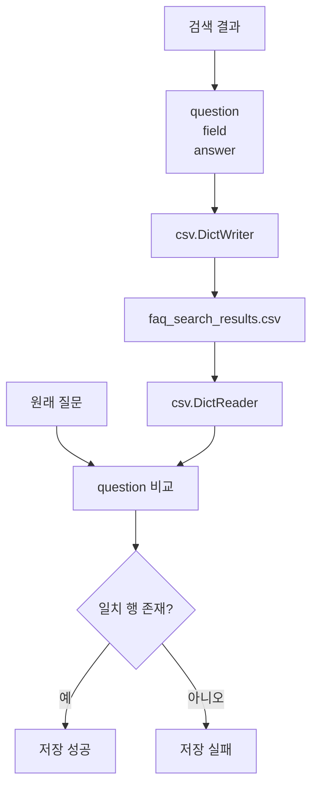

### 저장 흐름

```text
검색 결과
### 15.0 상위 책임 영역

전체 흐름을 읽을 때 먼저 설계 영역에서 목표와 구조를 정한 뒤, 아래 여섯 실행·평가 영역을 구분한다.

```text
Infrastructure = 실행 환경과 공통 객체 준비
Retrieval = 내부 FAQ와 외부 근거 수집
Orchestration = 질문의 실행 경로와 Tool 선택
Generation = Context와 history를 답변으로 변환
Persistence = 대화와 결과 파일 저장
Evaluation = 검색, 답변, Tool 선택 품질 측정
```

### 15.1 책임 영역별 전체 흐름도

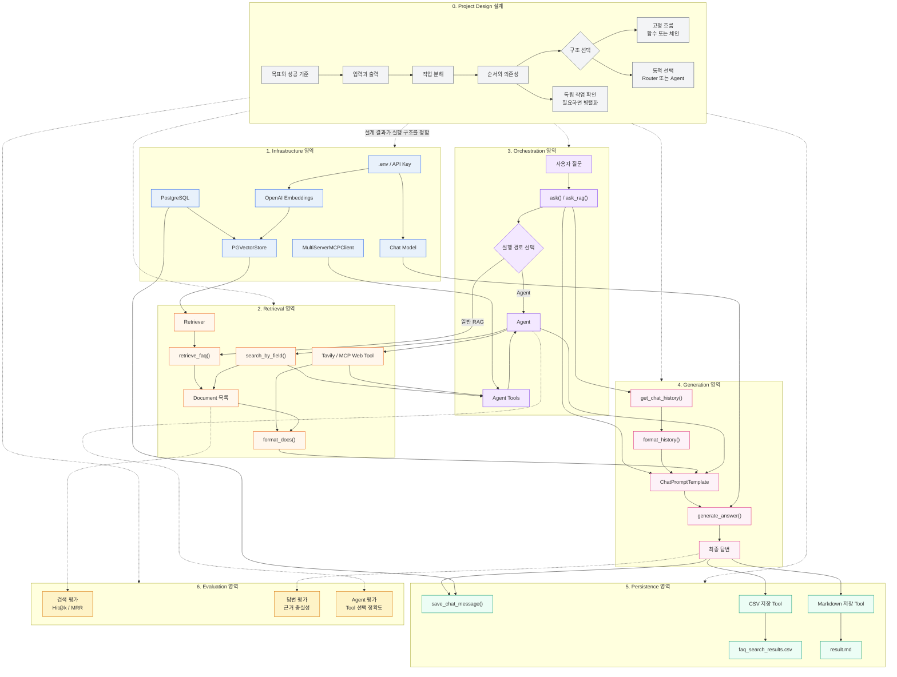

### 15.2 영역별 핵심 질문

| 영역 | 핵심 질문 | 대표 확인 대상 |
|---|---|---|
| Infrastructure | 실행에 필요한 객체가 준비되었는가? | API Key, DB, Model, Embedding |
| Retrieval | 적절한 근거 문서를 찾았는가? | `k`, `field`, Document, Context |
| Orchestration | 올바른 실행 경로와 Tool을 선택했는가? | `ask`, Agent, `tools` |
| Generation | 근거와 대화 이력이 답변에 반영되었는가? | Prompt, `model.invoke` |
| Persistence | 결과가 실제로 저장되었는가? | PostgreSQL, CSV, Markdown |
| Evaluation | 품질을 수치와 근거로 확인했는가? | Hit@k, MRR, Judge |

### 15.3 상세 실행 흐름

→ question, field, answer 준비
→ csv.DictWriter 생성
→ header가 없으면 header 작성
→ 한 행 추가
→ 저장 경로 반환
```

### 검증 흐름

```text
파일 존재 확인
→ csv.DictReader로 읽기
→ 원래 question과 비교
→ 일치 행 확인
→ 저장 성공 또는 실패 반환
```

### CSV 문제 확인 목록

- `csv_path`가 예상 위치인지 확인한다.
- 실행 기준 디렉터리가 올바른지 확인한다.
- CSV header가 `question`, `field`, `answer`와 일치하는지 확인한다.
- 저장할 때의 질문과 검증할 때의 질문이 같은지 확인한다.
- 검색 결과가 빈 문자열이 아닌지 확인한다.

```python
from pathlib import Path

print(Path(DEFAULT_CSV_PATH).resolve())
```

## 9. 실행 결과와 messages 확인

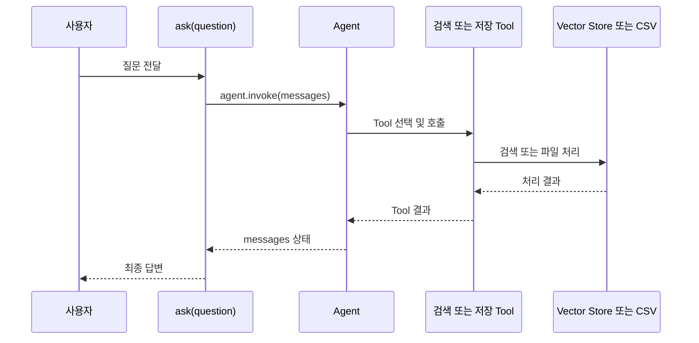

실행 후에는 최종 답변만 보지 말고 메시지 목록에서 다음을 확인한다.

```python
result = ask("의료 분야 CCTV는 어떻게 관리하나요?")

for message in result["messages"]:
    print(type(message).__name__)
    print(message)
```

### 확인할 내용

- 사용자 메시지가 정상적으로 들어갔는가?
- Agent가 어떤 Tool을 호출했는가?
- Tool 입력 인자가 예상과 같은가?
- 검색 결과가 Agent에게 반환되었는가?
- 최종 답변이 검색 결과를 근거로 작성되었는가?

## 10. 디버깅 흐름

정상 흐름과 오류 흐름을 분리해서 본다.

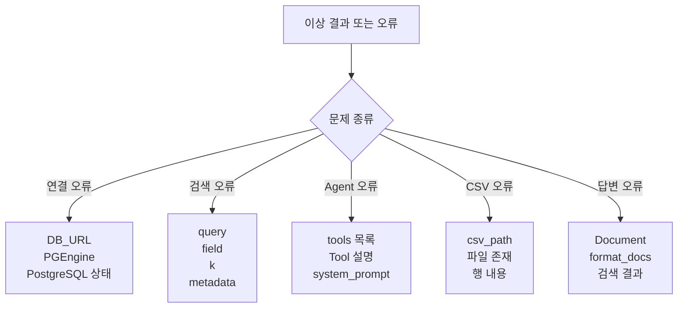

### 문제별 확인 순서

```text
DB 연결 오류
→ DB_URL
→ PGEngine
→ PostgreSQL 상태

검색 결과 없음 또는 부정확
→ query
→ field filter
→ k
→ embedding model
→ Document metadata

Agent가 Tool을 호출하지 않음
→ Tool 정의
→ args_schema
→ tools 목록
→ Tool 설명
→ system_prompt

CSV가 저장되지 않음
→ csv_path
→ 디렉터리 생성
→ 파일 존재 여부
→ header와 행 내용
→ verify_csv_saved

답변이 부정확함
→ 검색 Document
→ format_docs 결과
→ system_prompt
→ Agent 최종 답변
```

### 디버깅 원칙

최종 답변부터 수정하지 않는다. 다음 순서로 중간 결과를 확인한다.

```text
1. Agent가 어떤 Tool을 선택했는가?
2. Tool에 어떤 인자가 전달되었는가?
3. 검색된 Document가 존재하는가?
4. metadata가 올바른가?
5. format_docs 결과가 올바른가?
6. CSV가 실제로 저장되었는가?
7. 마지막으로 최종 답변을 확인한다.
```

## 11. 비교 분석과 Markdown 보고서 확장

**상태: 설계/확장.** Markdown 저장 예제는 있지만, 비교 분석과 보고서 생성의 연결 흐름은 구현되어 있지 않다. 현재 아이디어를 다음 흐름으로 확장할 수 있다.

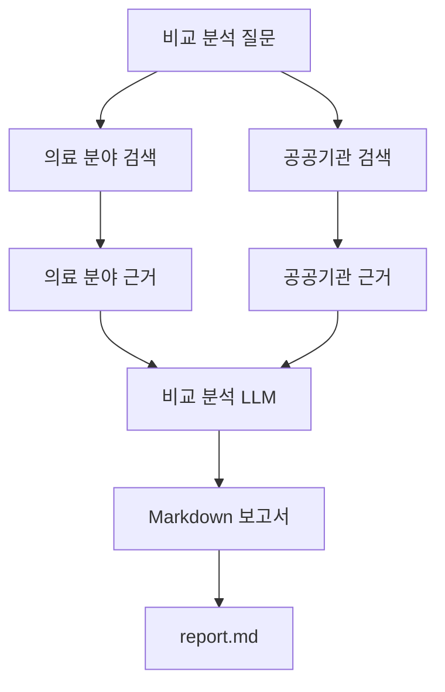

추가로 필요한 Tool은 다음과 같다.

```text
search_by_field를 두 분야에 대해 실행
→ 두 검색 결과를 비교 분석
→ 정해진 Markdown 형식으로 작성
→ report.md 저장
→ 파일 존재 여부 검증
```

이 기능은 기존 FAQ 저장 기능과 분리된 확장 단계로 구현하는 것이 좋다.

## 12. 다이어그램을 읽는 방법

### 색상 규칙

| 색상 | 의미 |
|---|---|
| 파란색 | 설정과 초기화 |
| 보라색 | Agent와 LLM |
| 주황색 | 검색과 RAG |
| 초록색 | CSV 저장과 검증 |
| 분홍색 | 최종 결과 |
| 빨간색 | 오류와 수정 지점 |

### 선 규칙

```text
실선: 실제 실행 흐름
점선: 참고 관계 또는 디버깅 연결
```

### 읽는 순서

```text
1. 전체 시스템 개요에서 구성요소를 확인한다.
2. 초기화 다이어그램에서 실행 전 객체를 확인한다.
3. Agent 다이어그램에서 Tool 선택 지점을 확인한다.
4. 검색 또는 CSV 경로 중 하나를 따라간다.
5. 파라미터 표에서 결과를 바꾸는 값을 확인한다.
6. 이상이 있으면 디버깅 다이어그램으로 이동한다.
```

### 한 가지 질문을 따라 읽는 예시

```text
의료 분야 CCTV는 어떻게 관리하나요?
→ ask(question)
→ HumanMessage
→ Agent
→ search_by_field
→ query + field
→ similarity_search
→ Document 목록
→ format_docs
→ 검색 결과 문자열
→ Agent
→ 최종 답변
```

저장까지 요청하면 다음 단계가 이어진다.

```text
검색 결과 문자열
→ save_faq_to_csv
→ faq_search_results.csv
→ verify_csv_saved
→ 저장 성공
→ 최종 답변
```

## 13. 가독성 유지 규칙

- 전체 개요에는 내부 파라미터를 넣지 않는다.
- 하나의 다이어그램은 하나의 학습 목표만 다룬다.
- 노드 하나에는 최대 3줄만 표시한다.
- 함수는 `function()` 형태로 표기한다.
- 데이터는 명사 형태로 표기한다.
- 파라미터는 상세 목차에서만 표시한다.
- 정상 흐름과 오류 흐름을 섞지 않는다.
- 하나의 화살표에는 하나의 의미만 부여한다.
- Tool 이름은 실제 Python 함수 이름과 동일하게 유지한다.
- Mermaid 다이어그램 아래에는 반드시 입력, 처리, 출력 설명을 둔다.

## 14. 최종 학습 루틴

```text
1. 01 전체 개요로 시스템 구조를 본다.
2. 02~07에서 개념과 파라미터를 학습한다.
3. 각 목차의 실험 코드를 실행한다.
4. Document, Tool 결과, messages를 직접 출력한다.
5. 파라미터를 하나씩 변경하고 결과를 비교한다.
6. 문제가 생기면 10 디버깅 흐름으로 돌아간다.
7. 마지막에 비교 분석과 Markdown 보고서로 확장한다.
```

이 문서의 역할은 다음과 같다.

```text
전체 다이어그램 = 시스템 지도
목차별 다이어그램 = 개념 교재
실험 코드 = 파라미터 학습 도구
디버깅 흐름 = 문제 해결 지도
```

## 15. 권장 아키텍처: Agent는 마지막에 연결한다

**상태: 설계/확장.** 함수 분리와 전체 책임 영역은 권장 목표 구조다. 저장소에는 일부 기능이 노트북으로 구현되어 있지만, 이 구조로 통합된 애플리케이션은 없다.

학습과 유지보수를 쉽게 하려면 Agent가 모든 작업을 직접 수행하게 만들지 않는다.
먼저 일반 Python 함수로 RAG 흐름을 완성한 뒤, 마지막에 Agent와 MCP Tool을 연결한다.

### 15.1 전체 시스템 조감도

아래 흐름도는 코드의 준비 단계와 실행 단계를 한 장에서 보는 대표 지도이다.
처음에는 모든 함수 내부를 읽지 말고, 화살표의 큰 방향만 확인한다.

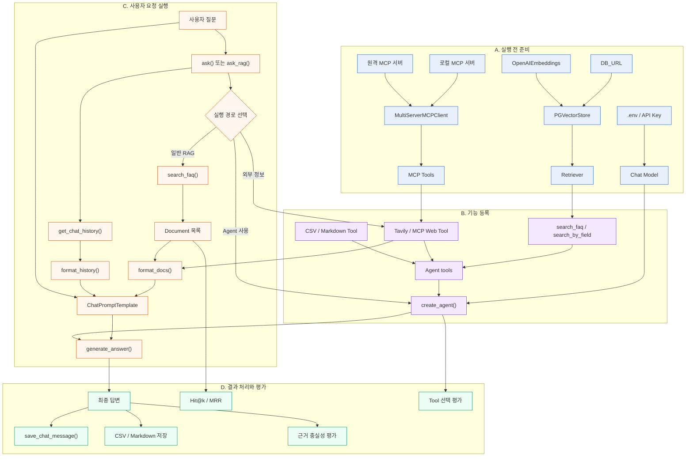

#### 조감도 읽는 순서

```text
1. A에서 모델, Vector Store, MCP Client가 준비된다.
2. B에서 검색 함수와 외부 Tool이 Agent에 등록된다.
3. C에서 질문이 ask() 또는 Agent로 들어간다.
4. FAQ 검색 결과와 대화 이력이 Prompt에 합쳐진다.
5. Chat Model이 답변을 생성한다.
6. D에서 답변, 대화 이력, 파일을 저장한다.
7. 검색 품질, 답변 근거, Tool 선택을 각각 평가한다.
```

#### 코드 요소 대응표

| 흐름도 영역 | 코드 요소 | 핵심 메서드 |
|---|---|---|
| 실행 전 준비 | `PGVectorStore`, `Chat Model` | `create_sync`, `init_chat_model` |
| MCP 연결 | `MultiServerMCPClient` | `get_tools` |
| 내부 검색 | `search_faq`, `search_by_field` | `similarity_search`, `invoke` |
| Agent 등록 | `create_agent` | `create_agent` |
| 대화 실행 | `ask`, `ask_rag` | `invoke`, `ainvoke` |
| Prompt 구성 | `ChatPromptTemplate` | `format_messages` |
| 답변 생성 | `generate_answer` | `model.invoke` |
| 결과 저장 | CSV, Markdown, PostgreSQL | `write`, `INSERT` |
| 품질 평가 | Hit@k, MRR, Judge | 순위 계산, 구조화 출력 |

### 15.2 상세 실행 흐름

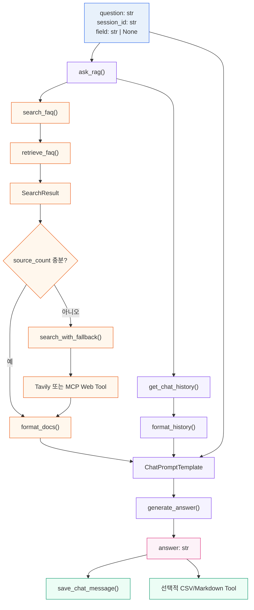

### 15.2 역할 경계

```text
RAG 함수
→ 내부 FAQ 검색과 답변 생성

SearchResult
→ 검색 문서, context, 출처 수를 하나의 결과로 전달

Tavily/MCP Tool
→ FAQ에 없거나 외부 정보가 필요한 경우에만 사용

대화 이력 저장소
→ session_id별 상태 관리

File Tool
→ CSV와 Markdown 저장

Agent
→ 검증된 함수를 Tool로 호출하고 작업 순서를 조정
```

핵심 원칙은 `Agent가 검색 로직을 소유하지 않는다`는 것이다. 검색 품질은 일반 함수로 테스트하고, Agent는 함수 또는 Tool을 선택하는 역할만 담당한다.

### 15.3 함수별 입력과 출력 계약

| 함수 | 입력 | 주요 메서드 | 반환값 | 책임 |
|---|---|---|---|---|
| `retrieve_faq` | `store`, `question`, `field` | `similarity_search` | `list[Document]` | 내부 FAQ 검색 |
| `format_docs` | `list[Document]` | `metadata.get` | `str` | LLM context 생성 |
| `search_faq` | `store`, `question`, `field` | `retrieve_faq` | `SearchResult` | 검색 결과 구조화 |
| `get_chat_history` | `session_id`, `limit` | PostgreSQL `SELECT` | `list[dict]` | 대화 조회 |
| `format_history` | `list[dict]` | 문자열 조합 | `str` | history 포맷팅 |
| `generate_answer` | `model`, `prompt`, `question`, `history`, `context` | `format_messages`, `invoke` | `str` | 답변 생성 |
| `save_chat_message` | `session_id`, `role`, `content` | PostgreSQL `INSERT` | `None` | 대화 저장 |
| `ask_rag` | `question`, `session_id`, `store`, `model`, `prompt`, `field` | 위 함수 조합 | `str` | 전체 RAG 조정 |

함수마다 하나의 책임만 두면 특정 단계만 교체하거나 테스트할 수 있다.

### 15.4 검색 결과 구조

```python
from dataclasses import dataclass


@dataclass
class SearchResult:
    documents: list
    context: str
    source_count: int
    source_type: str = "faq"
```

`source_type`을 추가하면 최종 답변에서 `faq`, `tavily`, `mcp` 중 어떤 근거를 사용했는지 구분할 수 있다.

### 15.5 핵심 함수 구현

```python
def retrieve_faq(
    store,
    question: str,
    field: str | None = None,
    k: int = 4,
) -> list:
    """질문과 선택적인 분야 조건으로 FAQ Document를 검색한다."""
    search_filter = {"field": field} if field else None

    return store.similarity_search(
        query=question,
        k=k,
        filter=search_filter,
    )
```

```python
def format_docs(docs: list) -> str:
    """검색된 Document를 LLM 입력용 context로 변환한다."""
    if not docs:
        return "검색된 참고자료가 없습니다."

    return "\n\n".join(
        (
            f"[{doc.metadata.get('title', '제목 없음')}]\n"
            f"분야: {doc.metadata.get('field', '분야 없음')}\n"
            f"{doc.page_content}"
        )
        for doc in docs
    )
```

```python
def search_faq(
    store,
    question: str,
    field: str | None = None,
    k: int = 4,
) -> SearchResult:
    """FAQ 검색 결과를 다음 단계에서 사용하기 쉬운 구조로 반환한다."""
    documents = retrieve_faq(store, question, field, k)

    return SearchResult(
        documents=documents,
        context=format_docs(documents),
        source_count=len(documents),
    )
```

### 15.6 외부 검색 fallback

FAQ 검색 결과가 없다고 해서 항상 웹 검색을 실행하지 않는다. 질문에 `최신`, `현재`, `최근`과 같은 표현이 있거나 FAQ 결과가 없을 때만 외부 Tool을 사용한다.

```python
def needs_external_search(question: str) -> bool:
    keywords = ["최신", "현재", "오늘", "최근", "웹 검색"]
    return any(keyword in question for keyword in keywords)


async def search_with_fallback(
    faq_result: SearchResult,
    question: str,
    external_search=None,
) -> SearchResult:
    """FAQ 결과가 부족할 때 Tavily 또는 MCP Tool을 사용한다."""
    if faq_result.source_count and not needs_external_search(question):
        return faq_result

    if external_search is None:
        return faq_result

    web_result = await external_search.ainvoke({"query": question})
    return SearchResult(
        documents=[],
        context=str(web_result),
        source_count=1,
        source_type="external",
    )
```

외부 Tool이 동기 Tool이면 `invoke()`를 사용하고, MCP처럼 비동기 호출을 제공하면 `ainvoke()`를 사용한다.

### 15.7 대화 이력과 답변 생성

```python
def format_history(history: list[dict]) -> str:
    if not history:
        return "이전 대화 없음"

    return "\n".join(
        f"{message['role']}: {message['content']}"
        for message in history
    )


def generate_answer(
    model,
    prompt,
    question: str,
    history: str,
    search_result: SearchResult,
) -> str:
    messages = prompt.format_messages(
        question=question,
        history=history,
        context=search_result.context,
    )

    response = model.invoke(messages)
    return response.content
```

### 15.8 전체 조정 함수

```python
async def ask_rag(
    question: str,
    session_id: str,
    store,
    model,
    prompt,
    field: str | None = None,
    external_search=None,
) -> str:
    """대화 조회부터 답변과 저장까지 전체 RAG 흐름을 실행한다."""
    history = get_chat_history(session_id)
    faq_result = search_faq(store, question, field)
    search_result = await search_with_fallback(
        faq_result,
        question,
        external_search,
    )

    answer = generate_answer(
        model=model,
        prompt=prompt,
        question=question,
        history=format_history(history),
        search_result=search_result,
    )

    save_chat_message(session_id, "human", question)
    save_chat_message(session_id, "ai", answer)
    return answer
```

이 함수는 `Agent` 없이 먼저 테스트할 수 있는 기준 구현이다.

### 15.9 Agent와 MCP 연결 지점

검증된 함수와 외부 MCP Tool을 마지막에 Agent에 등록한다.

```python
all_tools = local_tools + remote_tools

agent = create_agent(
    model=model,
    tools=all_tools,
    system_prompt="""
너는 FAQ 상담 Agent다.

- 내부 FAQ 질문은 검색 Tool을 사용한다.
- 최신 정보나 외부 페이지가 필요하면 MCP 또는 Tavily Tool을 사용한다.
- Tool 결과에 없는 내용은 추측하지 않는다.
- 파일 저장 요청은 저장 Tool을 호출한다.
""",
)
```

MCP는 다음과 같이 외부 Tool을 공급하는 계층으로 이해한다.

```text
MultiServerMCPClient
→ get_tools()
→ local_tools 또는 remote_tools
→ create_agent(tools=...)
→ Agent가 Tool 선택
```

### 15.10 학습과 테스트 순서

```text
1. retrieve_faq()를 실제 질문 하나로 테스트
2. Document의 page_content와 metadata 확인
3. format_docs() 결과 확인
4. generate_answer()를 검색 결과와 직접 연결
5. get_chat_history()와 save_chat_message() 추가
6. 검색 결과가 없을 때 fallback 테스트
7. Tavily 또는 MCP Tool을 외부 검색으로 연결
8. ask_rag() 전체 흐름 실행
9. 마지막에 Agent Tool로 등록
10. Tool 선택 정확도와 답변 근거를 평가
```

## 16. 권장 함수와 메서드

### 16.1 FAQ 검색

```python
def retrieve_faq(store, question: str, field: str | None = None) -> list:
    """질문과 선택적인 분야 조건으로 FAQ 문서를 검색한다."""
    if field:
        return store.similarity_search(
            question,
            k=4,
            filter={"field": field},
        )

    return store.similarity_search(question, k=4)
```

`store`를 함수에 직접 전달하면 특정 Retriever 내부 속성에 의존하지 않는다.
검색 정책이 바뀌어도 `retrieve_faq()`만 수정하면 된다.

### 16.2 Document 포맷팅

```python
def format_docs(docs: list) -> str:
    """검색된 Document를 LLM 입력용 문자열로 변환한다."""
    if not docs:
        return "검색된 참고자료가 없습니다."

    return "\n\n".join(
        (
            f"[{doc.metadata.get('title', '제목 없음')}]\n"
            f"분야: {doc.metadata.get('field', '분야 없음')}\n"
            f"{doc.page_content}"
        )
        for doc in docs
    )
```

`doc.metadata["title"]`처럼 직접 접근하면 metadata가 없는 문서에서 오류가 발생할 수 있다.
학습용 코드에서는 `.get()`으로 기본값을 제공하는 편이 안전하다.

### 16.3 검색 결과 구조화

```python
from dataclasses import dataclass


@dataclass
class SearchResult:
    documents: list
    context: str
    source_count: int
```

```python
def search_faq(store, question: str, field: str | None = None) -> SearchResult:
    """검색 문서와 LLM용 context를 함께 반환한다."""
    docs = retrieve_faq(store, question, field)

    return SearchResult(
        documents=docs,
        context=format_docs(docs),
        source_count=len(docs),
    )
```

문자열만 반환하는 대신 검색 문서 수와 원문 문서도 함께 보관하면 출처 표시와 디버깅이 쉬워진다.

### 16.4 대화 이력

```python
def get_chat_history(session_id: str, limit: int = 10) -> list:
    """session_id에 해당하는 최근 대화 이력을 조회한다."""
    # PostgreSQL SELECT 코드가 들어갈 위치
    return []


def format_history(history: list[dict]) -> str:
    """대화 이력을 Prompt에 넣을 문자열로 변환한다."""
    if not history:
        return "이전 대화 없음"

    return "\n".join(
        f"{message.get('role', 'unknown')}: {message.get('content', '')}"
        for message in history
    )


def save_chat_message(session_id: str, role: str, content: str) -> None:
    """사용자 또는 AI 메시지를 PostgreSQL에 저장한다."""
    # PostgreSQL INSERT 코드가 들어갈 위치
    pass
```

대화 이력을 사용할 때는 반드시 `session_id`를 기준으로 사용자별 대화를 분리한다.

### 16.5 답변 생성

```python
def generate_answer(
    model,
    prompt,
    question: str,
    history: str,
    context: str,
) -> str:
    """질문, 대화 이력, 검색 context를 사용해 답변을 생성한다."""
    messages = prompt.format_messages(
        history=history,
        context=context,
        question=question,
    )

    response = model.invoke(messages)
    return response.content
```

### 16.6 전체 RAG 실행 함수

```python
def ask_rag(
    question: str,
    session_id: str,
    store,
    model,
    prompt,
    field: str | None = None,
) -> str:
    """대화 이력 조회, FAQ 검색, 답변 생성, 이력 저장을 실행한다."""
    history = get_chat_history(session_id)
    search_result = search_faq(store, question, field)

    answer = generate_answer(
        model=model,
        prompt=prompt,
        question=question,
        history=format_history(history),
        context=search_result.context,
    )

    save_chat_message(session_id, "human", question)
    save_chat_message(session_id, "ai", answer)

    return answer
```

## 17. Tavily를 fallback으로 사용하기

**상태: 설계/확장.** Tavily 검색 도구 자체는 Agent 노트북에서 사용하지만, FAQ 결과와 최신성 판단에 따른 조건부 fallback은 현재 구현으로 확인되지 않았다.

Tavily는 모든 질문에 호출하지 않고 FAQ 검색 결과가 부족하거나 최신 웹 정보가 필요한 경우에만 사용한다.

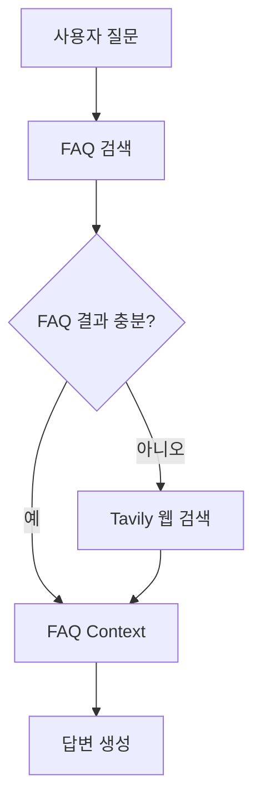

```python
def needs_web_search(question: str) -> bool:
    """최신 정보나 외부 검색이 필요한 질문인지 판단한다."""
    keywords = ["최신", "현재", "오늘", "최근", "웹 검색"]
    return any(keyword in question for keyword in keywords)
```

```python
def search_with_fallback(
    store,
    tavily_search,
    question: str,
    field: str | None = None,
) -> str:
    """FAQ 검색 결과가 부족할 때만 Tavily를 호출한다."""
    faq_result = search_faq(store, question, field)

    if faq_result.source_count > 0 and not needs_web_search(question):
        return faq_result.context

    web_result = tavily_search.invoke({"query": question})
    return str(web_result)
```

### Tavily의 역할

```text
search_by_field
→ 내부 FAQ 검색

TavilySearch
→ 외부 웹 검색

save_faq_to_csv
→ 검색 결과 저장

verify_csv_saved
→ 저장 결과 검증
```

## 18. Agent Tool 연결은 마지막에 한다

**상태: 권장 학습 순서.** 개별 RAG 기능을 확인한 뒤 Agent에 연결하라는 학습 순서다. 저장소에는 일부 기능이 이미 별도 노트북에 있으며, 이 순서로 재구성하는 것은 학습 과제다.

일반 함수가 독립적으로 검증된 뒤 Agent에 연결한다.

```python
agent = create_agent(
    model=model,
    tools=[
        search_by_field,
        web_search,
        save_faq_to_csv,
        verify_csv_saved,
        save_md,
    ],
    system_prompt="""
너는 개인정보 FAQ 상담 Agent다.

1. 분야가 지정되면 search_by_field를 사용한다.
2. 최신 정보나 웹 검색이 필요하면 web_search를 사용한다.
3. 검색 결과에 없는 내용은 추측하지 않는다.
4. CSV 저장 요청은 저장 후 검증한다.
5. Markdown 저장 요청은 save_md를 호출한다.
6. 최종 답변에는 근거와 저장 결과를 포함한다.
""",
)
```

Agent에 등록하는 Tool은 다음처럼 역할이 겹치지 않게 구성한다.

| Tool | 책임 |
|---|---|
| `search_by_field` | 내부 FAQ 분야별 검색 |
| `web_search` | Tavily 외부 검색 |
| `save_faq_to_csv` | FAQ 결과 CSV 저장 |
| `verify_csv_saved` | CSV 저장 여부 확인 |
| `save_md` | Markdown 파일 저장 |

## 19. 최종 구현 순서

```text
1. Document와 metadata 확인
2. similarity_search 실행
3. retrieve_faq() 구현
4. format_docs() 구현
5. Prompt에 context 전달
6. Chat Model 답변 생성
7. get_chat_history()와 save_chat_message() 추가
8. CSV 저장과 검증 추가
9. Tavily fallback 추가
10. ask_rag()로 전체 함수 연결
11. 마지막에 Agent Tool 등록
12. messages와 중간 결과로 검증
```

처음부터 다음 기능을 모두 Agent에 넣지 않는다.

```text
Agent + PGVector + 대화 이력 + Tavily + CSV + Markdown
```

대신 다음 단계로 개발한다.

```text
RAG 함수 완성
→ 대화 이력 추가
→ 외부 검색 추가
→ 파일 저장 추가
→ Agent 연결
```

이 구조의 장점은 각 함수와 메서드를 독립적으로 실행할 수 있고, 문제가 생겼을 때 검색, 프롬프트, 저장, Agent 중 어느 계층의 문제인지 빠르게 구분할 수 있다는 점이다.


## 20. ReAct Agent, 병렬 호출과 안전장치

**상태: 노트북별 구현 확인.** 기존 1~19절은 RAG의 검색·답변·Tool 연결을 설명한다. `12_React_agent`는 Agent가 도구를 반복 선택하는 실행 방식과 동시성, 호출 전후 안전장치를 이어서 학습하는 단계로 배치한다.

### 학습 경로

| 순서 | 자료 | 학습 목표 | 확인할 결과 |
|---|---|---|---|
| 1 | `12_React_agent/1_react기초.ipynb` | ReAct 루프와 Agent 메시지 흐름 이해 | AI의 tool call → ToolMessage → 다음 AI 응답 |
| 2 | `12_React_agent/2_병렬도구호출.ipynb` | 서로 독립적인 호출을 병렬 처리하고, 의존 작업은 순서대로 연결 | 병렬 호출 결과와 후속 Tool 입력 비교 |
| 3 | `12_React_agent/3_미들웨어안전장치.ipynb` | Tool 예외 처리와 모델 호출 제한 적용 | 오류 응답, 호출 제한에 도달했을 때의 동작 |
| 4 | 승인·재개 실습 | 부작용이 있는 Tool을 실행 전에 멈추고, 사람의 결정 뒤 이어서 실행 | `__interrupt__` 내용, 승인 또는 거부, 재개 후 Tool 결과 |

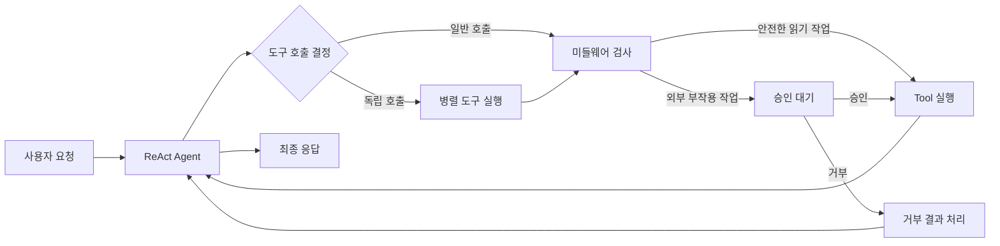

### 승인 인터럽트 사례

메일 발송처럼 외부에 영향을 주는 Tool 호출은 요청 내용만으로 발송을 완료한 것으로 간주하지 않는다. 실행 기록에 `__interrupt__`와 `action_requests`가 나타나면 Tool이 승인 대기 상태에 멈춘 것이다.

```text
사용자 요청
→ AI가 send_mail 도구와 수신자·제목·본문을 제안
→ 승인 미들웨어가 실행을 중단 (__interrupt__)
→ 사람이 요청 내용과 허용된 결정을 검토
→ 승인 시 재개되어 발송, 거부 시 발송 없이 종료
```

`send_mail` 설정이 도구 함수 안에 보이지 않더라도 Agent 생성부의 middleware 또는 승인 정책이 호출을 가로챌 수 있다. 따라서 다음 위치를 함께 확인한다.

1. Agent 생성 시 `middleware` 및 `interrupt_on` 설정
2. 승인 대상 Tool과 허용 결정(`approve`, `reject`)의 설정
3. 그래프 실행에 전달된 checkpointer와 대화별 `thread_id`
4. 인터럽트 이후 `Command` 등으로 재개하는 호출부
5. 재개 후 ToolMessage와 실제 외부 작업 결과

인터럽트가 관찰됐다는 사실만으로 어느 라이브러리 기본값이 원인이라고 단정하지 않는다. 미들웨어 구성, 실행 래퍼, 플랫폼 정책 중 실제 연결 지점을 확인한다. `__interrupt__` 발생은 발송 성공을 뜻하지 않으며, 승인 후 재개 결과로 발송 여부를 확인해야 한다.

### 구현 상태를 구분하는 기준

- `12_React_agent`의 세 노트북은 저장소 안의 학습 코드와 예제를 기준으로 구현 확인으로 기록한다.
- 메일 승인 사례는 실행 trace에 인터럽트가 나온 점까지 확인된 상태다. 저장소의 설정 코드나 재개 흐름을 확인하지 못했다면 승인 기능 전체를 구현 완료로 표기하지 않는다.
- 안전한 읽기 Tool과 외부 부작용 Tool을 구분하고, 최소 권한으로 승인 정책을 적용하는 것은 후속 설계 과제로 둔다.

### 실습 순서

```text
1. 1_react기초에서 messages를 따라 Agent → Tool → Agent 루프 확인
2. 독립적인 도구 두 개와 의존적인 도구 두 개를 각각 실행해 차이 관찰
3. 3_미들웨어안전장치에서 Tool 오류와 호출 횟수 제한 동작 확인
4. 읽기 Tool과 메일 발송 같은 부작용 Tool을 분류
5. 부작용 Tool에 승인 정책을 연결하고 승인·거부 경로를 각각 확인
6. thread_id와 checkpointer를 사용해 중단된 실행을 재개
7. 승인 전후 메시지 및 외부 작업 결과를 기록해 성공 여부 판단
```
