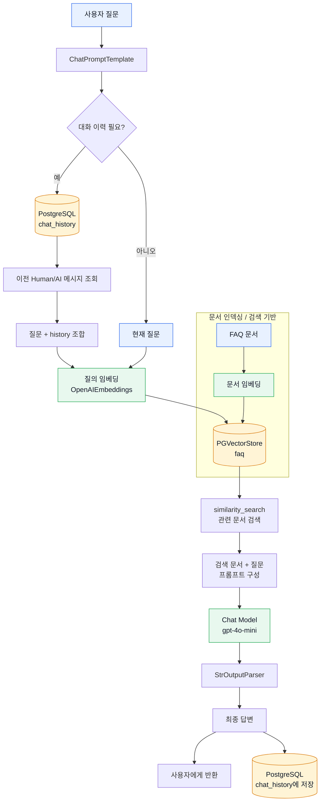

# LangChain 기반 RAG + 대화 이력 흐름

```mermaid
flowchart TB
    A[사용자 질문] --> B[ChatPromptTemplate]
    B --> C{대화 이력 필요?}
    C -->|예| D[(PostgreSQL<br/>chat_history)]
    D --> E[이전 Human/AI 메시지 조회]
    E --> F[질문 + history 조합]
    C -->|아니오| G[현재 질문]
    F --> H[질의 임베딩<br/>OpenAIEmbeddings]
    G --> H
    H --> I[(PGVectorStore<br/>faq)]
    I --> J[similarity_search<br/>관련 문서 검색]
    J --> K[검색 문서 + 질문<br/>프롬프트 구성]
    K --> L[Chat Model<br/>gpt-4o-mini]
    L --> M[StrOutputParser]
    M --> N[최종 답변]
    N --> O[사용자에게 반환]
    N --> P[(PostgreSQL<br/>chat_history에 저장)]

    subgraph Indexing[문서 인덱싱 / 검색 기반]
        Q[FAQ 문서] --> R[문서 임베딩]
        R --> I
    end

    classDef input fill:#E8F1FF,stroke:#2563EB,color:#111827
    classDef storage fill:#FFF4D6,stroke:#D97706,color:#111827
    classDef model fill:#E8F8EE,stroke:#16A34A,color:#111827
    class A,G,Q input
    class D,I,P storage
    class L,H,R model
```

> 핵심 구조: 질문을 임베딩하여 PGVectorStore에서 관련 FAQ를 검색하고, 검색 결과와 대화 이력을 함께 LLM에 전달한 뒤 답변을 저장합니다.