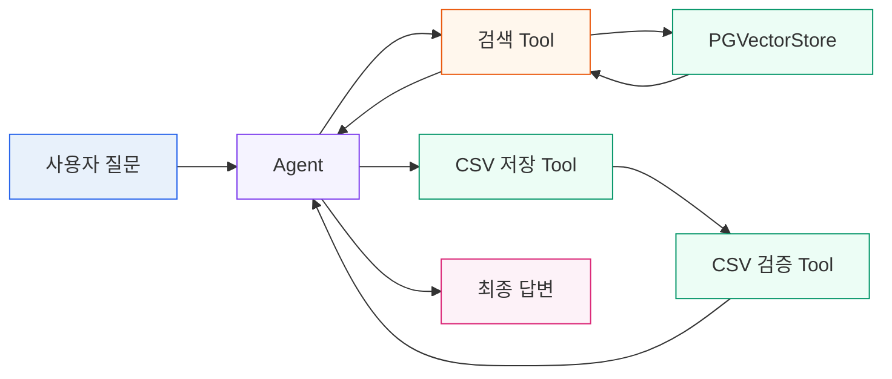
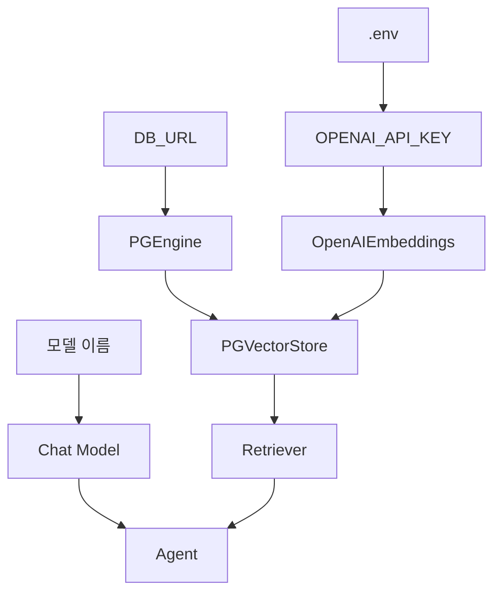
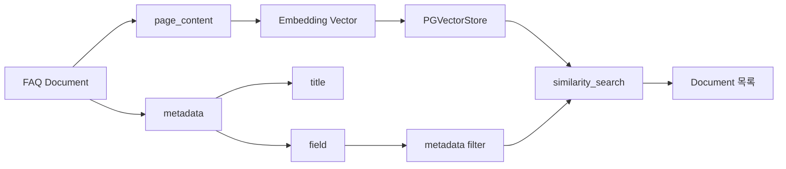
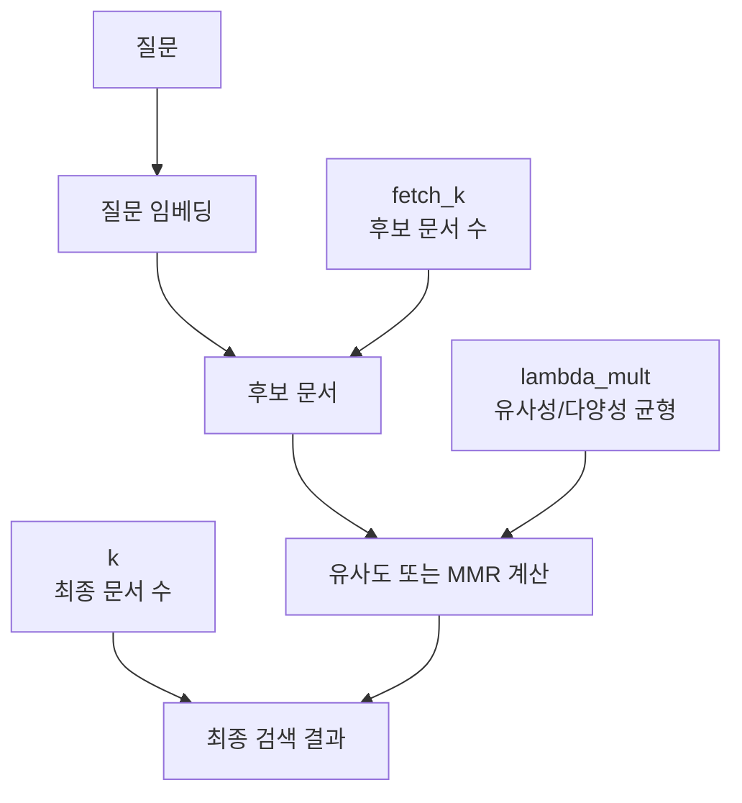
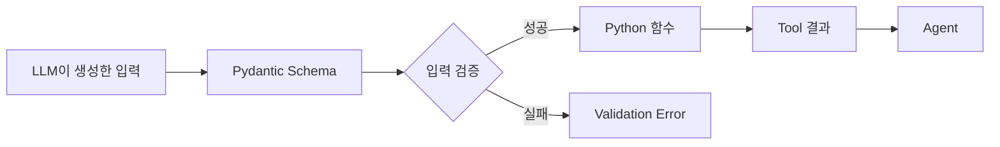
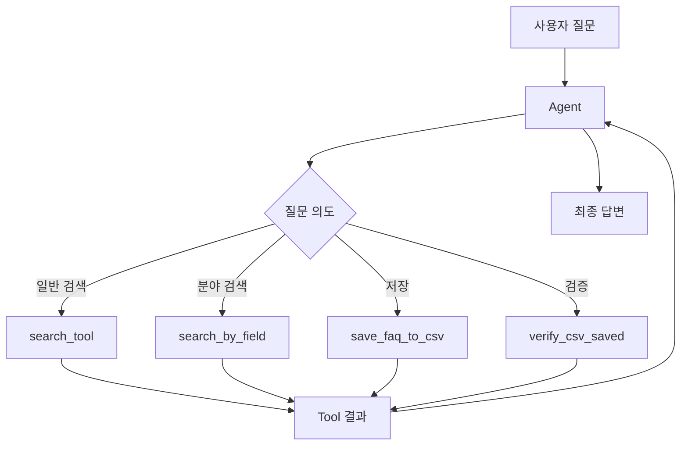
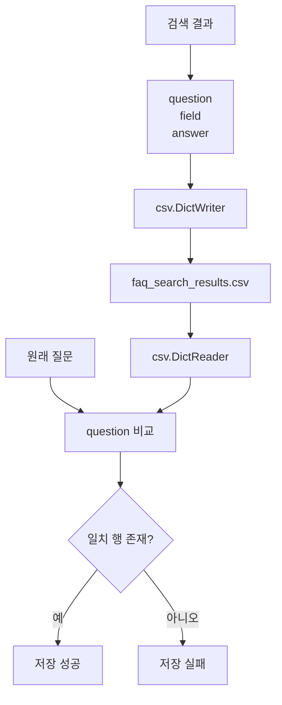
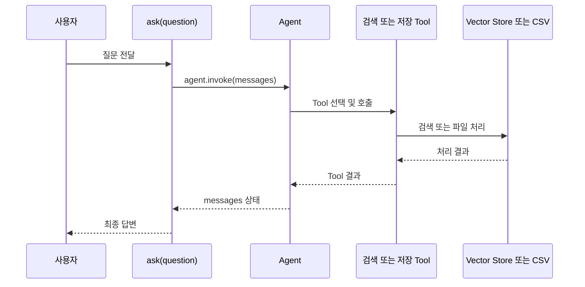
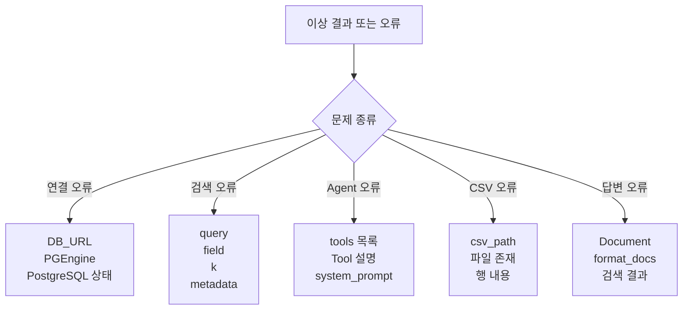
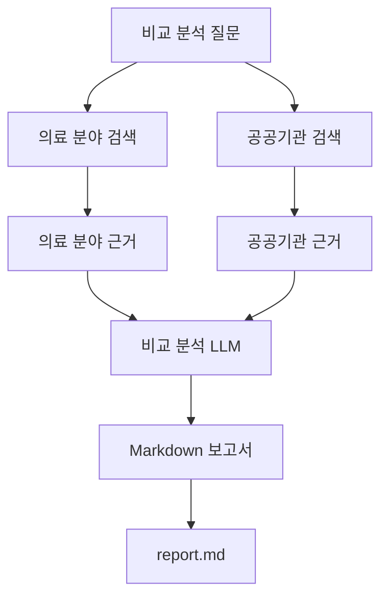

# Agent 기반 RAG 학습 지도

이 문서는 `2_agent_multi_toll.ipynb`의 전체 구조를 한눈에 파악하고, 각 코드 블록의 개념과 파라미터를 학습하기 위한 지도이다.

기존 `rag-flow.md`가 일반적인 RAG 체인의 흐름을 설명한다면, 이 문서는 다음 기능을 함께 연결한다.

- PostgreSQL과 PGVectorStore 초기화
- Embedding과 벡터 검색
- 일반 검색과 분야 필터 검색
- LangChain Tool과 Pydantic 입력 스키마
- Agent의 Tool 선택
- FAQ 검색 결과 CSV 저장"""
- CSV 저장 결과 검증
- 실행 결과와 디버깅 위치 확인

## 1. 전체 시스템 개요

먼저 세부 파라미터보다 구성요소 간 연결을 확인한다.



### 큰 흐름

```text
사용자 질문
→ ask(question)
→ HumanMessage
→ Agent
→ 검색 또는 저장 Tool 선택
→ Tool 결과 반환
→ 최종 답변
```

## 2. 문서 목차와 학습 목표

| 목차 | 학습 목표 | 핵심 코드 |
|---|---|---|
| 1. 전체 시스템 개요 | 구성요소 연결 파악 | `ask`, `agent` |
| 2. 환경과 초기화 | 실행 전 객체 생성 이해 | `load_dotenv`, `PGEngine` |
| 3. Vector Store | 문서, 벡터, metadata 이해 | `PGVectorStore` |
| 4. Retriever | 검색 방식과 파라미터 실험 | `k`, `fetch_k`, `lambda_mult` |
| 5. Tool과 Schema | 함수 입력 계약 이해 | `@tool`, `BaseModel`, `Field` |
| 6. Agent 실행 | LLM의 Tool 선택 이해 | `create_agent` |
| 7. CSV 저장과 검증 | 외부 파일 처리 이해 | `DictWriter`, `DictReader` |
| 8. 실행 결과 | 메시지와 중간 결과 확인 | `result["messages"]` |
| 9. 디버깅 | 문제 위치를 단계별로 좁히기 | 중간 결과 출력 |
| 10. 확장 | 비교 분석과 Markdown 보고서 | 다중 검색, 파일 생성 |

각 목차는 다음 질문에 답하도록 학습한다.

```text
이 개념은 무엇인가?
왜 필요한가?
어떤 입력을 받는가?
어떤 결과를 반환하는가?
어떤 파라미터가 동작을 바꾸는가?
문제가 생기면 어느 지점부터 확인하는가?
```

## 3. 환경과 초기화

실행 전 객체가 어떤 순서로 만들어지는지 확인한다.



### 확인할 개념

- `.env`: API 키와 같은 환경 설정을 읽는 파일
- `PGEngine`: PostgreSQL 연결을 관리하는 객체
- `OpenAIEmbeddings`: 텍스트를 벡터로 변환하는 모델
- `PGVectorStore`: 문서 벡터와 metadata를 검색하는 저장소
- `Chat Model`: Tool을 선택하고 답변을 생성하는 모델
- `Agent`: 모델과 Tool을 연결한 실행 주체

### 초기화 문제 확인 순서

```text
API Key 확인
→ DB_URL 확인
→ PostgreSQL 실행 상태 확인
→ PGEngine 연결 확인
→ PGVectorStore 테이블과 컬럼 확인
→ Embedding 모델 확인
→ Agent 생성 확인
```

## 4. Vector Store와 Document



### 핵심 개념

| 구성요소 | 역할 |
|---|---|
| `page_content` | 실제 의미 검색 대상인 FAQ 본문 |
| `metadata` | 검색 필터와 결과 표시를 위한 부가 정보 |
| `field` | 의료 분야, 공공기관 등의 분야 필터 |
| `title` | 답변에 근거 제목을 표시하기 위한 값 |
| `embedding` | 문장을 숫자 벡터로 변환한 결과 |
| `doc_id` | 문서를 구분하는 고유 ID |

### 학습 질문

- 왜 일반 문자열 검색 대신 벡터 검색을 사용하는가?
- `field`와 `title`을 metadata로 분리하는 이유는 무엇인가?
- 질문과 문서는 같은 Embedding 모델을 사용해야 하는가?
- 검색 결과의 `page_content`와 `metadata`는 각각 어디에 사용되는가?

## 5. Retriever와 검색 파라미터



### 주요 파라미터

| 파라미터 | 의미 | 실험 질문 |
|---|---|---|
| `search_type` | `similarity` 또는 `mmr` 검색 방식 | 중복 문서가 줄어드는가? |
| `k` | 최종 반환할 문서 수 | 문서 수가 늘면 답변이 좋아지는가? |
| `fetch_k` | MMR 후보 문서 수 | 후보를 많이 보면 다양성이 좋아지는가? |
| `lambda_mult` | 유사성과 다양성의 균형 | 관련성 중심과 다양성 중심 결과가 어떻게 다른가? |

### 파라미터 실험 순서

```python
for search_type in ["similarity", "mmr"]:
    test_retriever = store.as_retriever(
        search_type=search_type,
        search_kwargs={"k": 4},
    )
    docs = test_retriever.invoke("의료 분야 CCTV 관리")
    print(search_type, len(docs))
```

```text
1. similarity와 mmr 비교
2. k=1, 4, 8 비교
3. fetch_k 변화 확인
4. lambda_mult=0.0, 0.5, 1.0 비교
5. 검색 문서의 제목과 분야 확인
```

## 6. Tool과 Pydantic Schema



### Tool의 구조

```text
Tool 이름
→ 입력 스키마
→ 함수 실행
→ 문자열 또는 구조화된 결과
→ Agent로 반환
```

### 주요 개념

- `@tool`: Python 함수를 Agent가 호출할 수 있는 Tool로 변환한다.
- `BaseModel`: Tool 입력의 전체 구조를 정의한다.
- `Field`: 각 입력의 의미를 LLM에게 설명한다.
- `Literal`: 허용할 수 있는 값을 제한한다.
- `args_schema`: 함수와 Pydantic 입력 모델을 연결한다.

`Field(description=...)`는 단순한 주석이 아니다. Agent가 어떤 값을 넣어야 하는지 판단하는 Tool 사용 설명서이다.

### Tool 설명 양식

각 Tool은 다음 형식으로 정리한다.

```text
Tool 이름: search_by_field
입력: query, field
처리: field metadata 필터 + similarity search
출력: format_docs 결과 문자열
실패 조건: 허용되지 않은 field 또는 검색 문서 없음
```

## 7. Agent 실행



### Agent를 구성하는 세 요소

```python
agent = create_agent(
    model=model,
    tools=[
        search_tool,
        search_by_field,
        save_faq_to_csv,
        verify_csv_saved,
    ],
    system_prompt=system_prompt,
)
```

| 요소 | 역할 |
|---|---|
| `model` | 질문을 해석하고 Tool을 선택하며 답변을 생성한다. |
| `tools` | Agent가 실제로 호출할 수 있는 함수 목록이다. |
| `system_prompt` | Tool 호출 순서와 답변 규칙을 설명한다. |

`search_by_field`를 코드에서 정의했더라도 `tools` 목록에 등록하지 않으면 Agent가 호출할 수 없다.

## 8. CSV 저장과 검증



### 저장 흐름

```text
검색 결과
→ question, field, answer 준비
→ csv.DictWriter 생성
→ header가 없으면 header 작성
→ 한 행 추가
→ 저장 경로 반환
```

### 검증 흐름

```text
파일 존재 확인
→ csv.DictReader로 읽기
→ 원래 question과 비교
→ 일치 행 확인
→ 저장 성공 또는 실패 반환
```

### CSV 문제 확인 목록

- `csv_path`가 예상 위치인지 확인한다.
- 실행 기준 디렉터리가 올바른지 확인한다.
- CSV header가 `question`, `field`, `answer`와 일치하는지 확인한다.
- 저장할 때의 질문과 검증할 때의 질문이 같은지 확인한다.
- 검색 결과가 빈 문자열이 아닌지 확인한다.

```python
from pathlib import Path

print(Path(DEFAULT_CSV_PATH).resolve())
```

## 9. 실행 결과와 messages 확인



실행 후에는 최종 답변만 보지 말고 메시지 목록에서 다음을 확인한다.

```python
result = ask("의료 분야 CCTV는 어떻게 관리하나요?")

for message in result["messages"]:
    print(type(message).__name__)
    print(message)
```

### 확인할 내용

- 사용자 메시지가 정상적으로 들어갔는가?
- Agent가 어떤 Tool을 호출했는가?
- Tool 입력 인자가 예상과 같은가?
- 검색 결과가 Agent에게 반환되었는가?
- 최종 답변이 검색 결과를 근거로 작성되었는가?

## 10. 디버깅 흐름

정상 흐름과 오류 흐름을 분리해서 본다.



### 문제별 확인 순서

```text
DB 연결 오류
→ DB_URL
→ PGEngine
→ PostgreSQL 상태

검색 결과 없음 또는 부정확
→ query
→ field filter
→ k
→ embedding model
→ Document metadata

Agent가 Tool을 호출하지 않음
→ Tool 정의
→ args_schema
→ tools 목록
→ Tool 설명
→ system_prompt

CSV가 저장되지 않음
→ csv_path
→ 디렉터리 생성
→ 파일 존재 여부
→ header와 행 내용
→ verify_csv_saved

답변이 부정확함
→ 검색 Document
→ format_docs 결과
→ system_prompt
→ Agent 최종 답변
```

### 디버깅 원칙

최종 답변부터 수정하지 않는다. 다음 순서로 중간 결과를 확인한다.

```text
1. Agent가 어떤 Tool을 선택했는가?
2. Tool에 어떤 인자가 전달되었는가?
3. 검색된 Document가 존재하는가?
4. metadata가 올바른가?
5. format_docs 결과가 올바른가?
6. CSV가 실제로 저장되었는가?
7. 마지막으로 최종 답변을 확인한다.
```

## 11. 비교 분석과 Markdown 보고서 확장

현재 노트북의 비교 분석 아이디어는 다음 흐름으로 확장할 수 있다.



추가로 필요한 Tool은 다음과 같다.

```text
search_by_field를 두 분야에 대해 실행
→ 두 검색 결과를 비교 분석
→ 정해진 Markdown 형식으로 작성
→ report.md 저장
→ 파일 존재 여부 검증
```

이 기능은 기존 FAQ 저장 기능과 분리된 확장 단계로 구현하는 것이 좋다.

## 12. 다이어그램을 읽는 방법

### 색상 규칙

| 색상 | 의미 |
|---|---|
| 파란색 | 설정과 초기화 |
| 보라색 | Agent와 LLM |
| 주황색 | 검색과 RAG |
| 초록색 | CSV 저장과 검증 |
| 분홍색 | 최종 결과 |
| 빨간색 | 오류와 수정 지점 |

### 선 규칙

```text
실선: 실제 실행 흐름
점선: 참고 관계 또는 디버깅 연결
```

### 읽는 순서

```text
1. 전체 시스템 개요에서 구성요소를 확인한다.
2. 초기화 다이어그램에서 실행 전 객체를 확인한다.
3. Agent 다이어그램에서 Tool 선택 지점을 확인한다.
4. 검색 또는 CSV 경로 중 하나를 따라간다.
5. 파라미터 표에서 결과를 바꾸는 값을 확인한다.
6. 이상이 있으면 디버깅 다이어그램으로 이동한다.
```

### 한 가지 질문을 따라 읽는 예시

```text
의료 분야 CCTV는 어떻게 관리하나요?
→ ask(question)
→ HumanMessage
→ Agent
→ search_by_field
→ query + field
→ similarity_search
→ Document 목록
→ format_docs
→ 검색 결과 문자열
→ Agent
→ 최종 답변
```

저장까지 요청하면 다음 단계가 이어진다.

```text
검색 결과 문자열
→ save_faq_to_csv
→ faq_search_results.csv
→ verify_csv_saved
→ 저장 성공
→ 최종 답변
```

## 13. 가독성 유지 규칙

- 전체 개요에는 내부 파라미터를 넣지 않는다.
- 하나의 다이어그램은 하나의 학습 목표만 다룬다.
- 노드 하나에는 최대 3줄만 표시한다.
- 함수는 `function()` 형태로 표기한다.
- 데이터는 명사 형태로 표기한다.
- 파라미터는 상세 목차에서만 표시한다.
- 정상 흐름과 오류 흐름을 섞지 않는다.
- 하나의 화살표에는 하나의 의미만 부여한다.
- Tool 이름은 실제 Python 함수 이름과 동일하게 유지한다.
- Mermaid 다이어그램 아래에는 반드시 입력, 처리, 출력 설명을 둔다.

## 14. 최종 학습 루틴

```text
1. 01 전체 개요로 시스템 구조를 본다.
2. 02~07에서 개념과 파라미터를 학습한다.
3. 각 목차의 실험 코드를 실행한다.
4. Document, Tool 결과, messages를 직접 출력한다.
5. 파라미터를 하나씩 변경하고 결과를 비교한다.
6. 문제가 생기면 10 디버깅 흐름으로 돌아간다.
7. 마지막에 비교 분석과 Markdown 보고서로 확장한다.
```

이 문서의 역할은 다음과 같다.

```text
전체 다이어그램 = 시스템 지도
목차별 다이어그램 = 개념 교재
실험 코드 = 파라미터 학습 도구
디버깅 흐름 = 문제 해결 지도
```
