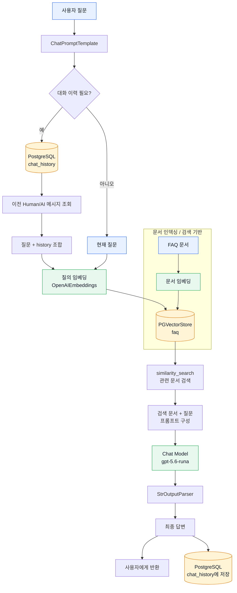

# LangChain 기반 RAG + 대화 이력 흐름

> 시스템 전체구조 구성 흐름도
> 핵심 구조: 질문을 임베딩하여 PGVectorStore에서 관련 FAQ를 검색하고, 검색 결과와 대화 이력을 함께 LLM에 전달한 뒤 답변을 저장합니다.

> 이 사항을 코드로 설명 가능해야 한다
> question, field, history가 왜 필요한지 여부 
> retriever input -> output
> RunnableParallel 이 무엇인지
> context를 어디서 생성하고 프롬프트에는 어떻게 사용되는 지
> 검색결과가 없거나 잘못된 경우 어떤 상황이 발생되는 가?
