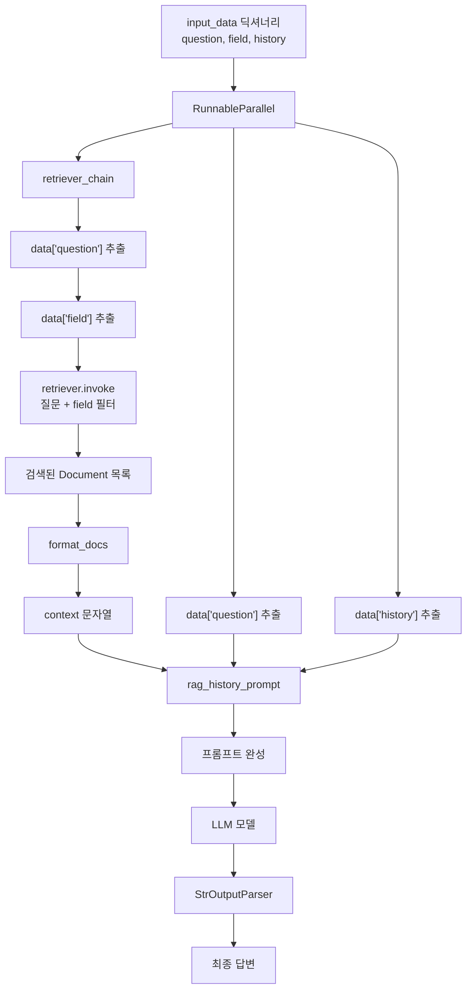

# RAG 흐름



## 실행 흐름

```text
input_data
→ RunnableParallel
→ 문서 검색
→ context 문자열 생성
→ history와 question 결합
→ ChatPromptTemplate
→ LLM
→ StrOutputParser
→ 최종 답변
```

## 입력 예시

```python
input_data = {
    "question": "CCTV 영상을 확인하고 싶은데 어떻게 해야 하나요?",
    "field": "의료 분야",
    "history": [],
}
```
