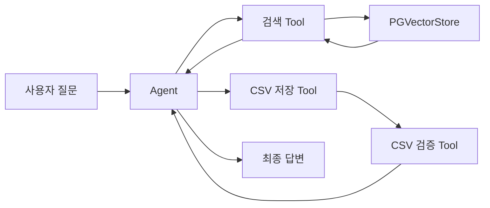

# Agent 기반 RAG에서 Tool 선택과 결과 검증 흐름 정리

일반적인 RAG는 질문에 맞는 문서를 검색해 LLM 답변의 근거로 사용한다. 여기에 Agent를 더하면 질문의 의도에 따라 검색, 분야별 검색, 파일 저장 같은 작업을 선택해 실행하는 구조로 확장할 수 있다.

Agent 기반 RAG의 구성요소와 데이터 흐름을 학습 지도 형태로 정리하였으며 핵심은 Agent의 최종 답변만 보지 않고, Tool이 선택되고 결과가 돌아오는 중간 과정에 적응하는 것이다

## 1. Agent 기반 RAG의 전체 흐름

```text
사용자 질문
→ ask(question)
→ Agent
→ 검색 또는 저장 Tool 선택
→ Tool 실행 결과 반환
→ Agent 최종 답변
```

1. 검색 요청이면 Retriever와 벡터 저장소가 관련 문서를 찾음
2. 분야 조건이 필요하면 metadata 필터를 함께 적용 
3. 결과를 파일로 남기는 요청은 저장 Tool로 전달 및  저장 후  검증 Tool을 통해 파일 내용을    확인하는 흐름으로 구성 가능



## 2. Tool은 입력과 출력의 계약이다

1. Agent가 Python 함수를 호출하려면 함수가 어떤 작업을 하는지, 어떤 값을 받아야 하는지 알아야 한다. 
2. Tool 설명과 입력 스키마를 정의하고, 만든 Tool을 Agent 설정의 `tools` 목록에 정리.

- `@tool`: 함수를 Agent가 사용할 Tool로 만든다.
- `BaseModel`: 입력의 필드와 자료 구조를 정의한다.
- `Field(description=...)`: 각 입력값의 의미를 설명한다.
- `Literal`: 허용할 입력값을 제한할 수 있다.
- `args_schema`: Tool 함수와 입력 스키마를 연결한다.

- 예를 들어 분야별 검색 Tool은 검색어와 분야를 입력받고, 분야 값에 따라 metadata 필터를 적용해 문서 결과 반환. 
- 코드에 함수를 정의했더라도 Agent의 Tool 목록에 등록하지 않으면 Agent가 호출할 수 없음.

## 3. 벡터 검색과 metadata 필터

### 벡터 검색 구성에서는 문서 본문과 metadata의 역할을 구분한다.

| 항목 | 역할 |
| --- | --- |
| `page_content` | 임베딩 및 의미 검색의 대상이 되는 본문 |
| `metadata` | 분야, 제목, 출처 등 필터링과 결과 표시용 정보 |
| `embedding` | 텍스트를 숫자 벡터로 표현한 값 |
| `Retriever` | 질문과 관련된 Document를 가져오는 인터페이스 |

### Retriever의 검색 방식과 파라미터는 결과에 영향을 준다.

- `search_type`: similarity 또는 MMR 방식 선택
- `k`: 최종 반환할 문서 수
- `fetch_k`: MMR이 선택하기 전에 살펴볼 후보 문서 수
- `lambda_mult`: 유사성과 결과 다양성의 균형

한 번에 여러 값을 바꾸기보다는 similarity와 MMR을 비교한 다음 `k`, `fetch_k`, `lambda_mult`를 하나씩 바꾸고 문서 제목과 분야를 확인하는 편이 결과 차이를 해석하기 쉽다.

## 4. CSV 저장은 다시 읽어 확인하기

검색 결과를 CSV에 저장하는 흐름은 다음과 같다.

```text
질문·분야·답변 준비
→ csv.DictWriter로 행 추가
→ 저장 경로 반환
→ csv.DictReader로 파일 다시 읽기
→ 원래 질문과 일치하는 행 확인
```

1. 파일이 생성됐다는 사실만으로 의도한 데이터가 저장됐다고 볼 수는 없다. 
2. 실행 기준 디렉터리와 `csv_path`, header 이름, 저장할 때와 검증할 때의 질문 값 여부를 확인.

## 5. 중간 결과부터 디버깅하기

- Agent의 답변이 기대와 다를 때는 아래 순서로 확인하자

1. Agent가 어떤 Tool을 선택했는가?
2. Tool에 어떤 입력값이 전달됐는가?
3. 검색된 Document가 있는가?
4. Document의 metadata와 `format_docs` 결과가 올바른가?
5. CSV 저장 경로와 실제 행이 예상과 일치하는가?
6. 마지막으로 최종 답변이 검색 근거를 반영했는가?

즉, 최종 답변을 먼저 손보기보다 Agent와 Tool 사이의 중간 결과를 먼저 살펴보는 것이 좋다.

## 6. 다음에 직접 검증할 항목

1. PostgreSQL 연결, 실제 Agent의 Tool 선택, 검색 결과, CSV 저장 성공을 이 문서만으로 확인한 것은 아니다. 
2. 다음 실습에서는 노트북을 실행해 각 단계를 확인할 예정이다.

- Agent에 등록한 Tool과 입력 스키마가 의도한 대로 동작하는지 확인
- 같은 질문에 대한 similarity와 MMR 결과 비교
- 실행 결과 `messages`에서 Tool 호출과 반환값 확인
- CSV 저장 후 파일을 다시 읽어 질문과 결과 행 확인

## 마무리

Agent 기반 RAG는 검색 기능에 Tool 선택과 외부 작업을 연결한 구조다. 입력 스키마는 Agent와 함수 사이의 약속이고, 중간 결과 확인은 문제의 위치를 찾는 단서다. 다음 단계에서는 학습 지도에 정리한 순서대로 노트북을 실행하며 설계와 실제 동작을 하나씩 대조해 보자.
